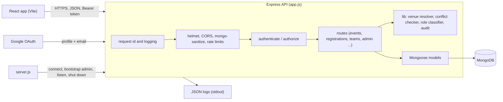
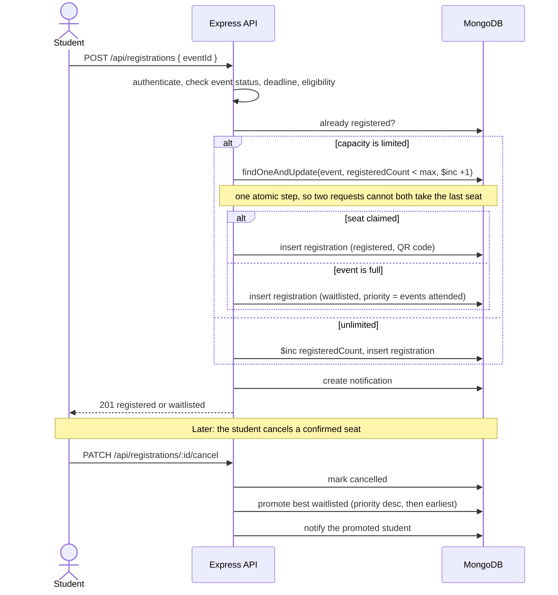
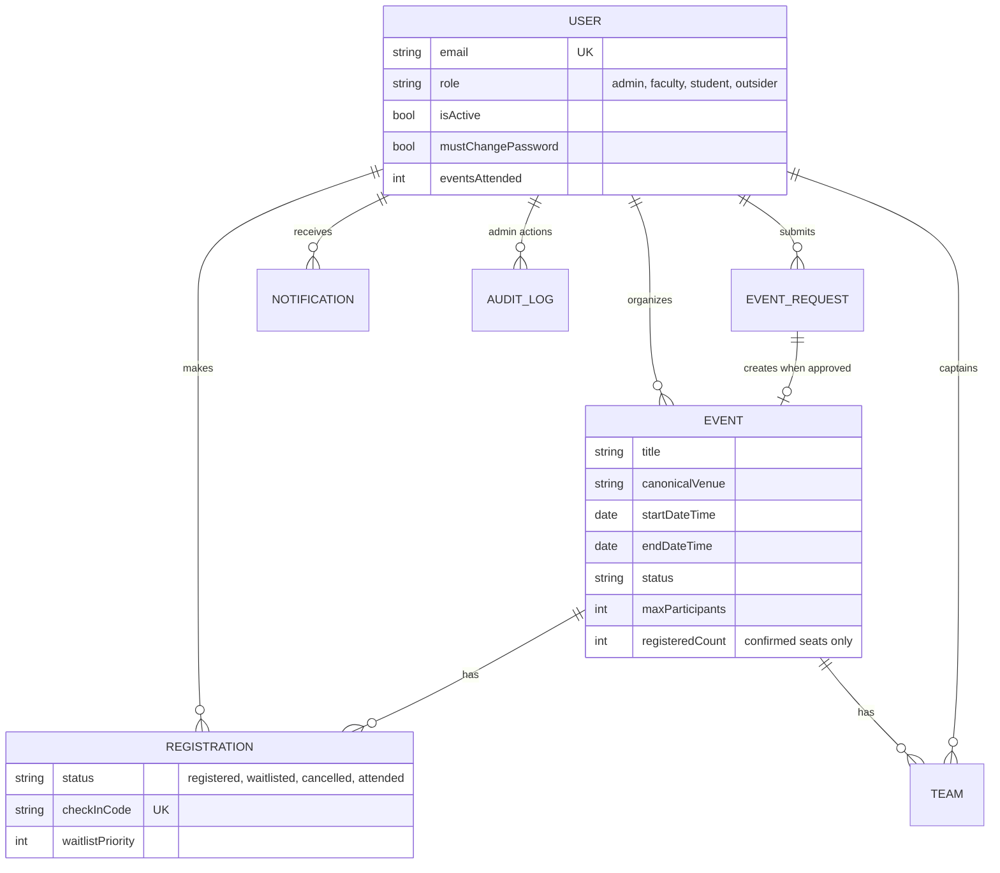

<div align="center">

# LNMIIT Event Hub

### One place for campus events: schedule them without venue clashes, register with a waitlist, check people in by QR code, and run it all from an admin panel

[](https://github.com/adarshcod30/LNMIIT-Event-Management-System/actions/workflows/ci.yml)
[](LICENSE)
[](https://github.com/adarshcod30/LNMIIT-Event-Management-System/commits/main)


[**Report a bug**](https://github.com/adarshcod30/LNMIIT-Event-Management-System/issues) &nbsp;·&nbsp; [**Request a feature**](https://github.com/adarshcod30/LNMIIT-Event-Management-System/issues)

</div>

---

## Table of Contents

- [Overview](#overview)
- [Key Features](#key-features)
- [Tech Stack](#tech-stack)
- [System Architecture](#system-architecture)
- [Application Flow](#application-flow)
- [Data Model](#data-model)
- [Security Model](#security-model)
- [Testing](#testing)
- [Deployment & Infrastructure](#deployment--infrastructure)
- [Project Structure](#project-structure)
- [Getting Started](#getting-started)
- [API Reference](#api-reference)
- [Known Limitations](#known-limitations)
- [Roadmap](#roadmap)
- [Contributing](#contributing)
- [License](#license)
- [Contact](#contact)

---

## Overview

**Problem.** A campus runs dozens of events a month across lecture theatres, labs, sports courts and lawns. Bookings live in chats and spreadsheets, two events end up in the same hall at the same time, "LT-1", "lt1" and "Lecture Hall 1" are treated as three different rooms, and nobody knows who actually turned up.

**Solution.** Event Hub is a MERN application with a server that owns the rules. Every venue name is resolved to one canonical venue (86 LNMIIT venues with aliases and fuzzy matching), every booking is checked for time overlap before it is saved, registrations respect capacity with a priority waitlist, and every administrative action is written to an audit log. Roles (admin, faculty, student, outsider) come from the user's email address and are enforced on the server for every request.

**Why it matters.** The interesting engineering is in the boundaries: a seat that two students ask for at the same moment, a status an organizer must not be able to give their own rejected event, a spreadsheet cell that must not run as a formula. Those are exactly the places this repository is tested hardest (see [Testing](#testing)).

**Keywords:** `mern` `express` `react` `mongodb` `event-management` `rbac` `jwt` `google-oauth` `jest` `supertest` `github-actions` `lnmiit`

## Key Features

| Feature | What it does |
|---|---|
| **Role-based access** | Roles are derived from the email on the server (`23ucs509@lnmiit.ac.in` is a student, `name@lnmiit.ac.in` is faculty, anything else is an outsider) and checked on every protected route. Strict parsing: an address with two `@` signs is refused. |
| **Venue resolution** | 86 venues, each with aliases. `lt1`, `LT 1` and `Lecture Hall 1` all become `LT-1`. Close typos are matched by edit distance, scaled to the length of the input so short nonsense is not guessed at. |
| **Conflict detection** | A booking that overlaps an approved or ongoing event at the same venue is refused (409). Back-to-back bookings are allowed. Rounds of multi-round events are checked individually. Faculty cannot override; the admin can, with a recorded reason. |
| **Registration and waitlist** | Seats are claimed with a single atomic update, so the last seat cannot be given to two people. Past capacity, users join a waitlist ordered by past attendance, then by time. Cancelling a confirmed seat promotes the next person and notifies them. |
| **Check-in** | A unique QR code per registration. Organizers, co-organizers and the admin can check people in, once, and only if the registration is confirmed. |
| **Student event requests** | Students propose events with venue-clash warnings; the admin approves (which creates the event) or rejects with a reason. A request is decided once. |
| **Teams** | Team events with captains, invitations, accept and reject, minimum and maximum sizes. |
| **Admin panel** | Dashboard, analytics, user management (role change, deactivate), event approval, broadcast announcements, CSV exports, audit log. |
| **Audit trail** | Role changes, deactivations, event status changes, pins and deletions, request reviews and broadcasts are logged with who, what, which record and from which IP. |
| **Calendar and exports** | iCalendar download per event; CSV exports of registrations, users and events with formula-injection protection. |
| **Operations** | Request ids on every response and log line, structured JSON logs with credentials redacted, liveness and readiness endpoints, graceful shutdown, fail-fast production configuration. |

## Tech Stack

| Layer | Technology |
|---|---|
| Frontend | React 19, Vite 8, Tailwind CSS 4, React Router 6, TanStack Query, Recharts, react-hook-form, react-qr-code |
| Backend / API | Node.js 22, Express 4, Passport (Google OAuth 2.0), JSON Web Tokens, helmet, express-rate-limit, express-mongo-sanitize |
| Database | MongoDB with Mongoose 8 |
| Logging | Pino and pino-http (structured JSON, request ids, redaction) |
| Testing | Jest 30 (unit and integration projects), Supertest, mongodb-memory-server |
| CI | GitHub Actions: dependency audit, tests with a coverage gate, frontend lint and build |

## System Architecture

The browser talks to one Express API. The API is built by a factory (`app.js`) that has no side effects, which is what lets the tests run the real application in memory. `server.js` is the only file that connects to MongoDB, listens on a port and handles signals.



**In plain language.** Every request first gets an id and is logged. Security middleware runs next (headers, CORS, stripping of `$`-operators from input, rate limits). Protected routes check the token and the role. Route handlers are thin: the rules live in `lib/` (who is allowed to manage an event, whether a venue is free, what role an email has), so they can be tested without HTTP.

## Application Flow

Registering for an event with limited seats is the most delicate flow, because the seat count must stay right when many people register at once.



## Data Model



Notable constraints: a unique index on `(event, user)` stops duplicate registrations, a unique `(event, name)` on teams stops reused team names, and `registeredCount` always means confirmed seats (waitlisted and cancelled registrations do not count).

## Security Model

Every row below is covered by tests; the file names are where to look.

| Threat | Control |
|---|---|
| Forged or replayed tokens | HS256 only, algorithm pinned on verify. Access and refresh tokens carry a `type`, and each is accepted only where it belongs, so a stolen refresh token cannot call the API. (`tests/unit/jwt.test.js`) |
| Secrets in source | No secret has a default in the code. In production the process refuses to start unless `JWT_SECRET` and `SESSION_SECRET` are set, long, different from each other and not placeholders. Elsewhere a random per-process secret is used. (`tests/unit/config.test.js`) |
| Default admin password | None exists. The first start uses `ADMIN_INITIAL_PASSWORD`, or generates a random one and prints it once. The admin must change it, and the server blocks every other route until they do. (`bootstrapAdmin.test.js`, `auth.test.js`) |
| Passwordless login in production | The demo login only exists when `ENABLE_DEMO_LOGIN=true` outside production, and can never sign in as the admin. |
| Account enumeration | A missing admin account and a wrong password produce the same status, message and (roughly) timing. |
| Brute force | Failed credential attempts are limited (10 per 15 minutes per IP); successful logins are not counted, and `/auth/me` is not limited. A general limit applies to the API. Set `TRUST_PROXY` behind a reverse proxy so limits see real client IPs. |
| NoSQL injection | `express-mongo-sanitize` strips `$` operators; query parameters are cast and refused if invalid; user search escapes regular expressions. |
| Mass assignment | Create and update endpoints copy only a whitelist of fields. An organizer cannot set their own event's status, owner or counters. (`events.test.js`) |
| Broken access control | Server-side role and ownership checks on every route; unapproved events are invisible (404) to everyone except their organizer and the admin; an unauthenticated sweep over every protected route asserts 401. (`security.test.js`) |
| CSV injection | Every exported cell is quoted, quotes are doubled, and cells that start with `=`, `+`, `-` or `@` are neutralised. (`sanitize.test.js`, `registrations.test.js`) |
| Calendar injection | iCalendar text is escaped and lines end in CRLF, so a title cannot add properties. File names are sanitised. |
| Information leaks | In production a 500 never includes the underlying message; request logs redact `Authorization` and cookies. |
| Race conditions | Seats, promotion and check-in use single conditional updates. A concurrency test registers eight users against three seats at once. |
| Dependencies | `npm audit --omit=dev` runs in CI at high severity. Unused packages were removed. |

## Testing

The suite is split into two Jest projects that share one config (`backend/jest.config.js`):

| Project | What it runs | Size |
|---|---|---|
| `unit` | Pure functions and middleware, no database | 212 tests, 8 files |
| `integration` | The real Express app over HTTP with Supertest, against an in-memory MongoDB | 239 tests, 13 files |

**451 tests pass.** Measured coverage across the backend: statements 92.7%, branches 88.3%, functions 97.8%, lines 93.9%. The thresholds in `jest.config.js` sit just below that, so a drop fails the build.

```bash
cd backend
npm test                    # everything
npm run test:unit           # milliseconds, no database
npm run test:integration    # real app, in-memory MongoDB
npm run test:coverage       # with the coverage report and gate
npm run test:watch          # unit tests in watch mode
```

The first integration run downloads a MongoDB binary once (cached afterwards). No credentials or network services are needed, and the tests never read `backend/.env`.

### How Jest is used

- **Two projects, one config.** Unit and integration are separate projects with their own setup, selectable with `--selectProjects`.
- **One database server, one database per file.** `globalSetup` starts a single in-memory MongoDB; each test file connects to its own database and empties every collection between tests, so files run in parallel without sharing state.
- **Table-driven tests with `test.each`**, for example one row per role and eligibility combination, per overlap shape for the conflict checker, per hostile CSV cell.
- **Fake timers** to test token expiry to the second and the shutdown grace period without waiting.
- **Mocks and spies** (`jest.mock`, `jest.spyOn`) for the user model in middleware tests, for a failing audit write, and for a failing database call to prove production error output hides internals.
- **Custom matchers** (`toBeApiSuccess(201)`, `toBeApiError(403, /pattern/)`) so every API assertion reads as one line.
- **Real failure modes, not just happy paths:** a real database disconnect for the readiness check, eight simultaneous registrations for the seat race, a forged unsigned token.
- **A coverage gate** so the numbers cannot quietly drift down.

### What writing the tests found

The tests were written to describe correct behaviour and run against the original code first. Of the first 236 integration tests, **74 failed**. Each failure was either a real defect or a feature the README promised and the code did not have:

| Found | Fixed |
|---|---|
| `POST /api/auth/demo-login` signed in as **any user, including the admin, with only an email**, with no environment guard | Opt-in, off in production, never for the admin |
| The admin bootstrap password was **hard-coded in the source** and in the README | From `ADMIN_INITIAL_PASSWORD` or random; forced change enforced on the server |
| JWT and session secrets fell back to **strings in the source** | Required in production, random elsewhere |
| A refresh token worked as an access token, and the reverse | Typed tokens, algorithm pinned |
| `PUT /api/events/:id` passed the request body straight to the database: an organizer could **approve their own rejected event** or give it to someone else | Field whitelist |
| `PATCH /api/events/:id/status` stored **any string** as a status | Validated against the schema |
| Drafts and rejected events were readable through `GET /api/events/:id` and the `.ics` download | Visible only to organizers and the admin |
| Cancelling a **waitlisted** registration promoted someone else, though no seat was freed; cancelling twice decremented the count twice | Cancellation is a state transition; counts are atomic |
| `registeredCount` counted waitlisted people | Counts confirmed seats only |
| Check-in could be repeated (double-counting attendance), and any faculty member could check in anyone | Once only, confirmed registrations only, organizers and admin only |
| Approving the same event request twice **created two events** | A request is decided once (409) |
| The conflict query matched a round's venue against a *different* round's times and reported clashes that did not exist | `$elemMatch` |
| User search put the raw query into `$regex` (a crash, and a way to run patterns) | Escaped |
| CSV exports did not escape quotes or formulas; the `.ics` file did not escape text | Shared sanitisers |
| The auth rate limit covered `/auth/me`, which the front end calls on every page load, so normal use could lock a user out | Only failed credential attempts count |
| `GET /api/events?limit=100000` returned the whole collection | Page size capped |
| Audit logging was promised for all admin actions; **nothing wrote to it** | Implemented and tested |
| The venue fuzzy match used a fixed edit distance, so the nonsense input `xyz` resolved to the SAC Gym | Distance scales with input length |
| `classifyRole("x@evil.com?@lnmiit.ac.in")` returned `faculty` | Exactly one `@` required |

Beyond the API, running the application end to end found two front-end problems: the Admin Users tab used a `search` variable that was never declared (it crashed on render), and the admin was redirected to a `/change-password` page that did not exist. Both are fixed.

## Deployment & Infrastructure

There is no hosted deployment of this project. It is built to be deployed, and the parts that matter for that are in place and tested:

| Concern | How it is handled |
|---|---|
| Hosting | Any Node host plus MongoDB Atlas. The API is a single stateless process (sessions are stored in MongoDB), so it scales horizontally. |
| Configuration | Environment variables only (see `backend/.env.example`). In production `assertProductionConfig` stops the process at start-up and lists everything that is wrong. |
| Health checks | `GET /api/health` is liveness (never touches the database). `GET /api/health/ready` is readiness and returns 503 while MongoDB is unreachable. |
| Reverse proxy | Set `TRUST_PROXY=1` behind one proxy so rate limits use the real client IP. |
| Logging | JSON to stdout via Pino, one line per request with its id, `Authorization` and cookies redacted, level set by `LOG_LEVEL`. The `X-Request-Id` header lets a user quote an id when something fails. |
| Shutdown | On SIGTERM or SIGINT the server stops listening, lets in-flight requests finish, closes MongoDB, and force-exits only after 10 seconds. |
| CI | GitHub Actions on every push and pull request: dependency audit, 451 tests with the coverage gate, frontend lint and build. |
| Environments | Development (demo login available), test (in-memory MongoDB, no `.env` read), production (strict configuration, no demo login, generic 500 messages). |

Production checklist: set `NODE_ENV=production`, `MONGODB_URI`, `JWT_SECRET`, `SESSION_SECRET` (two different 32+ character random values), `CLIENT_URL` (the exact front-end origin), `ADMIN_INITIAL_PASSWORD`, `TRUST_PROXY`, and the Google OAuth variables. Do not set `ENABLE_DEMO_LOGIN`.

## Project Structure

```
.
├── backend/
│   ├── app.js                  Express app factory (no side effects, used by tests)
│   ├── server.js               Entry point: connect, bootstrap admin, listen, shut down
│   ├── lib/
│   │   ├── config.js           Secrets, demo-login switch, production config check
│   │   ├── jwt.js              Typed access and refresh tokens
│   │   ├── roleClassifier.js   Email to role
│   │   ├── venueResolver.js    86 venues, aliases, fuzzy matching
│   │   ├── conflictChecker.js  Venue and time overlap detection
│   │   ├── permissions.js      Who may manage an event
│   │   ├── sanitize.js         CSV, iCalendar, regex, filename, field whitelisting
│   │   ├── pagination.js       Bounded page and limit parsing
│   │   ├── respond.js          One place that turns errors into responses
│   │   ├── audit.js            Audit trail writer
│   │   ├── requestLogger.js    Request ids and structured logs
│   │   ├── shutdown.js         Graceful shutdown
│   │   ├── bootstrapAdmin.js   First-run admin account
│   │   └── passport.js, email.js, db.js
│   ├── middleware/             auth.js, rateLimiter.js
│   ├── models/                 User, Event, Registration, Team, EventRequest, Notification, AuditLog
│   ├── routes/                 auth, users, events, venues, registrations, teams, event-requests, notifications, admin, search
│   ├── scripts/seed.js         Demo data (refuses to run in production)
│   ├── tests/
│   │   ├── unit/               No database
│   │   ├── integration/        Real app + in-memory MongoDB
│   │   ├── helpers/            App builder and data factories
│   │   └── setup/              Environment, global MongoDB, per-file lifecycle, custom matchers
│   └── jest.config.js
├── frontend/                   React app (pages, context, API client)
└── .github/workflows/ci.yml
```

## Getting Started

Prerequisites: Node.js 22 (20 works), npm, and a MongoDB (a free [Atlas](https://www.mongodb.com/atlas) cluster, or a local `mongod`).

```bash
git clone https://github.com/adarshcod30/LNMIIT-Event-Management-System.git
cd LNMIIT-Event-Management-System

# 1. Install everything
npm run install-all

# 2. Configure the backend and the frontend
cp backend/.env.example backend/.env       # then set MONGODB_URI
cp frontend/.env.example frontend/.env

# 3. Seed demo data (1 admin, 5 faculty, 20 students, 2 outsiders, 15 events ...)
ADMIN_INITIAL_PASSWORD='choose-something-here' npm run seed

# 4. Run both servers
npm run dev
```

- Frontend: http://localhost:5173
- Backend: http://localhost:5001 (not 5000: macOS uses that port for AirPlay Receiver)

**Signing in locally.** With `ENABLE_DEMO_LOGIN=true` (the default in `.env.example`) the login page offers Quick Login for the seeded faculty, student and outsider accounts. The admin signs in under **Admin Login** with `admin@lnmiit.ac.in` and the password you gave in `ADMIN_INITIAL_PASSWORD` (or the one the seed script printed), and is asked to change it straight away. For real accounts, set up Google OAuth below.

<details>
<summary><b>Google OAuth setup</b></summary>

1. Open the [Google Cloud Console](https://console.cloud.google.com) and create a project.
2. **APIs & Services, Credentials, Create Credentials, OAuth 2.0 Client ID**, type **Web application**.
3. Authorised JavaScript origin: `http://localhost:5173`.
4. Authorised redirect URI: `http://localhost:5001/api/auth/google/callback`.
5. Put the client id and secret in `backend/.env` as `GOOGLE_CLIENT_ID` and `GOOGLE_CLIENT_SECRET`.
6. On the OAuth consent screen, add your test accounts.

</details>

## API Reference

All routes are under `/api`. "Auth" means a valid access token (`Authorization: Bearer ...`). Errors are always `{ "success": false, "error": "..." }`.

| Area | Method and path | Access | Purpose |
|---|---|---|---|
| Auth | `GET /auth/google`, `GET /auth/google/callback` | public | Google sign-in |
| | `POST /auth/admin/login` | public | Admin email and password |
| | `POST /auth/admin/change-password` | admin | Replace the password |
| | `POST /auth/demo-login` | dev only | Passwordless login for seeded users (never the admin) |
| | `POST /auth/refresh` | refresh token | New token pair |
| | `GET /auth/me`, `POST /auth/logout` | auth / public | Current user, log out |
| Users | `GET /users/profile`, `PUT /users/profile` | auth | Own profile (whitelisted fields) |
| | `GET /users/search?q=` | auth | Directory search, 2+ characters |
| | `GET /users`, `PATCH /users/:id/role`, `PATCH /users/:id/toggle-active` | admin | User management (audited) |
| Events | `GET /events`, `GET /events/:id`, `GET /events/:id/ics` | public, filtered by role and status | Browse, one event, calendar file |
| | `POST /events` | admin, faculty | Create (venue resolved, conflicts checked) |
| | `PUT /events/:id`, `DELETE /events/:id` | organizer, admin | Edit, delete |
| | `PATCH /events/:id/status`, `PATCH /events/:id/pin` | admin | Approve, reject, cancel, pin (audited) |
| Venues | `GET /venues`, `POST /venues/resolve`, `GET /venues/search?q=` | public | List, resolve a typed name, search |
| Registrations | `POST /registrations` | auth | Register or join the waitlist |
| | `GET /registrations/my` | auth | My registrations |
| | `PATCH /registrations/:id/cancel` | owner, admin | Cancel (promotes the waitlist) |
| | `GET /registrations/event/:eventId`, `GET /registrations/export/:eventId` | organizers, admin | Attendees, CSV |
| | `POST /registrations/:id/checkin`, `POST /registrations/checkin-code` | organizers, admin | Check in |
| Teams | `POST /teams`, `POST /teams/:id/invite`, `PATCH /teams/:id/respond-invite` | auth | Create, invite, accept or reject |
| | `GET /teams/my`, `GET /teams/event/:eventId`, `DELETE /teams/:id` | auth, captain or admin | List, disband |
| Event requests | `POST /event-requests` | student | Propose an event |
| | `GET /event-requests/my` | auth | My requests |
| | `GET /event-requests`, `PATCH /event-requests/:id/review` | admin | Review (audited) |
| Notifications | `GET /notifications`, `GET /notifications/unread-count`, `PATCH /notifications/:id/read`, `PATCH /notifications/read-all` | auth | Mine only |
| | `POST /notifications/broadcast` | admin | Announce to everyone or one role (audited) |
| Admin | `GET /admin/dashboard`, `/admin/analytics`, `/admin/audit-logs`, `/admin/export/users`, `/admin/export/events` | admin | Panel data and exports |
| Search | `GET /search?q=` | public | Full-text event search |
| Health | `GET /health`, `GET /health/ready` | public | Liveness, readiness |

## Known Limitations

Stated plainly, so nobody finds them by surprise:

- **Tokens live in `localStorage`.** Any script injection in the front end could read them. The usual fix is an httpOnly cookie for the refresh token.
- **The Google OAuth callback passes tokens in the redirect URL.** They can end up in browser history.
- **Refresh tokens are stateless.** They cannot be revoked individually before they expire (7 days). Deactivating a user does stop them, because the user is checked on every request and refresh.
- **No email is sent.** `lib/email.js` exists, but no route calls it. Notifications are in-app only.
- **No multi-document transactions.** Seat counting uses atomic single-document updates, which is enough for the invariants above, but a crash between two writes can leave a stale counter.
- **Venue fuzzy matching has no tie-break.** A typo that is equally close to two venues asks the user to choose rather than guessing.
- **The front end has four `exhaustive-deps` lint warnings** (not errors) that are worth a refactor.
- **No hosted demo.**

## Roadmap

- [ ] Send email notifications (the module is there, it needs wiring and tests)
- [ ] Move the refresh token to an httpOnly cookie and add server-side revocation
- [ ] Front-end tests with React Testing Library and Vitest
- [ ] Hosted deployment with preview environments
- [ ] OpenAPI description generated from the routes
- [ ] Move to TypeScript, starting with `lib/`

## Contributing

1. Fork and create a branch named after the change (`fix-waitlist-ordering`).
2. `npm run install-all`, then make the change **with a test**: `npm test` must pass and coverage must stay above the gate.
3. `npm run lint` in `frontend/` must report no errors.
4. Open a pull request describing what changed and why.

## License

MIT. See [LICENSE](LICENSE).

## Contact

Built by **Adarsh Dwivedi**, B.Tech CSE, LNMIIT Jaipur. [GitHub](https://github.com/adarshcod30) · [LinkedIn](https://www.linkedin.com/in/adarshdwivedi30) · 23ucs509@lnmiit.ac.in
